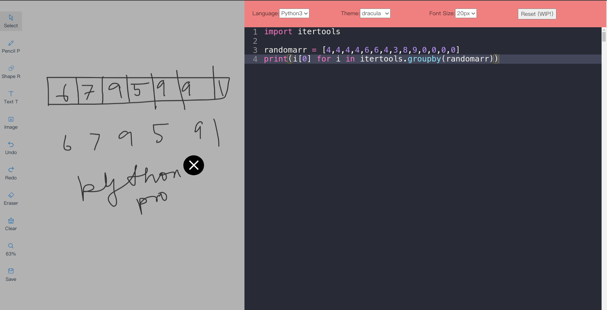

# [**Draw and Code**](https://draw-and-code.vercel.app/)

> Irritated at switching tabs while explaining code in a presentation? Now you can draw and code in the same tab, easily!


## **Screenshot**:



## **Thanks to**:

- [React Drawing Board by dilidili](https://github.com/dilidili/react-drawing-board)

- [React Ace by securingsincity](https://github.com/securingsincity/react-ace)

- [React Sliding Side Panel by BenedictGiraud](https://github.com/BenedicteGiraud/react-sliding-side-panel)

## **Development**:

### Available Scripts

In the project directory, you can run:

```sh
$ yarn start
```

Runs the app in the development mode.\
Open [http://localhost:3000](http://localhost:3000) to view it in the browser.

The page will reload if you make edits.\
You will also see any lint errors in the console.
